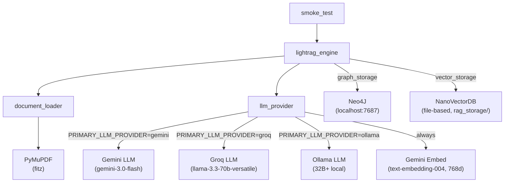

# Phase 1 — LightRAG Core Build Plan

## Overview

4 backend files to write/extend + 3 docs to update. No HTTP server, no frontend. The smoke test script is the only run target.

## Provider Order (corrected per user confirmation)

- **Primary**: Gemini (`gemini-3.0-flash`, low thinking budget)
- **Fallback**: Groq (`llama-3.3-70b-versatile`)
- **Last resort**: Ollama (any 32B+ local model)
- **Embedding**: Always Gemini `models/text-embedding-004` at 768 dims — never switches

## Key LightRAG API Facts (verified via context7 docs)

LightRAG constructor signature:

```python
LightRAG(
    working_dir="./backend/rag_storage",
    llm_model_func=<async callable>,
    llm_model_name="<model name>",
    embedding_func=<decorated func>,
    graph_storage="Neo4JStorage",   # overrides default
    # NanoVectorDBStorage is LightRAG's default vector store — no key needed
)
```

Insert with citation support:

```python
await rag.ainsert(input=[text_string], file_paths=["truecaller.pdf"])
```

Query:

```python
await rag.aquery("question", param=QueryParam(mode="mix", only_need_context=False))
```

## Files

### 1. `[backend/requirements.txt](backend/requirements.txt)` — Create

List all deps the AI must install via `uv pip install -r backend/requirements.txt`:

- `lightrag-hku` — core RAG + Neo4J + Gemini + Ollama adapters
- `pymupdf` — PDF parsing (`import pymupdf` or `import fitz`)
- `python-dotenv`
- `httpx`
- `neo4j`
- `numpy`
- `fastapi`, `uvicorn` — needed in Phase 2, pin now

### 2. `[backend/llm_provider.py](backend/llm_provider.py)` — Extend (do not rewrite what exists)

The file already has `verify_groq_api_key` and `verify_gemini_api_key`. The AI must **add** two new exports:

`**get_embedding_func()`**

- Always returns a Gemini embedding function decorated with `@wrap_embedding_func_with_attrs(embedding_dim=768, max_token_size=2048, model_name="models/text-embedding-004")`
- Inside, call `gemini_embed.func(texts, api_key=GEMINI_API_KEY, model="models/text-embedding-004")`
- Import: `from lightrag.llm.gemini import gemini_embed`
- Import: `from lightrag.utils import wrap_embedding_func_with_attrs`
- This function is module-level, not a factory — define it once as a decorated coroutine

`**get_llm_func() -> tuple[Callable, str]`**
Returns `(llm_async_callable, model_name_str)` based on `PRIMARY_LLM_PROVIDER` env var:

- `gemini`: wrap `gemini_model_complete` from `lightrag.llm.gemini` — pass `model_name="gemini-3.0-flash"`, include `thinking_budget=1024` (low) in kwargs if Gemini 3.0 supports it. The wrapper must match LightRAG's expected async callable signature: `(prompt, system_prompt, history_messages, keyword_extraction, **kwargs) -> str`
- `groq`: wrap `openai_complete_if_cache` from `lightrag.llm.openai` with `base_url="https://api.groq.com/openai/v1"` and `api_key=GROQ_API_KEY`, model `llama-3.3-70b-versatile`
- `ollama`: wrap `ollama_model_complete` from `lightrag.llm.ollama`, read model name from env `OLLAMA_LLM_MODEL` (default `"qwen2.5:32b"`)
- Raise `ValueError` with clear message if `PRIMARY_LLM_PROVIDER` is unrecognized
- Each wrapper function must have a `try/except` around the provider call and re-raise with a meaningful message

### 3. `[backend/lightrag_engine.py](backend/lightrag_engine.py)` — Create

Two public async functions. Keep each under 40 lines.

`**index_document(pdf_path: str) -> None`**

- Call `document_loader.load_pdf(pdf_path)` → `(text, metadata)`
- Build LightRAG instance (call `_build_rag()` helper to avoid duplication)
- `await rag.initialize_storages()`
- In `try/finally`: call `await rag.ainsert(input=[text], file_paths=[pdf_path])`, then `await rag.finalize_storages()`
- Log filename and page count before inserting

`**query(question: str) -> dict`**

- Build and initialize LightRAG the same way (same `_build_rag()` helper)
- `await rag.aquery(question, param=QueryParam(mode="mix", only_need_context=False))`
- Return `{"answer": <raw_string>, "raw": <full_response>}` — Phase 2 will add `risk_level` parsing
- Wrap everything in `try/finally` with `finalize_storages()`

`**_build_rag() -> LightRAG**`

- Calls `get_llm_func()` and `get_embedding_func()` from `llm_provider`
- Sets `working_dir=./backend/rag_storage`, `graph_storage="Neo4JStorage"`
- Reads Neo4j connection env vars (LightRAG's `Neo4JStorage` reads `NEO4J_URI`, `NEO4J_USERNAME`, `NEO4J_PASSWORD`, `NEO4J_DATABASE` directly from environment — just ensure `load_dotenv()` is called before building)

### 4. `[backend/document_loader.py](backend/document_loader.py)` — Create

One public function: `**load_pdf(pdf_path: str) -> tuple[str, dict]**`

- `import pymupdf` — open with `pymupdf.open(pdf_path)`
- Iterate pages. For each page, extract blocks with `page.get_text("blocks", sort=True)` — each block is `(x0, y0, x1, y1, text, block_no, block_type)`
- Header/footer heuristic: skip a block if `len(block_text.strip()) < 50` AND (`y0 < page.rect.height * 0.10` OR `y1 > page.rect.height * 0.90`)
- Join accepted block texts per page, join pages with `\n\n`
- Return `(full_text, {"filename": os.path.basename(pdf_path), "page_count": doc.page_count})`
- Wrap the open call in `try/except` — raise `RuntimeError` if the file is not a valid PDF

### 5. `[backend/smoke_test.py](backend/smoke_test.py)` — Create

Single `async def main()` run with `asyncio.run(main())`:

1. Resolve path to a PDF in `backend/documents/` (hardcode `truecaller_tos.pdf` as default, fall back to first PDF in directory)
2. Call `await lightrag_engine.index_document(pdf_path)` — print "Indexing done."
3. Call `result = await lightrag_engine.query("Does Truecaller share my contacts with third parties?")`
4. Print full result dict
5. Print reminder: "Check Neo4j at [http://localhost:7474](http://localhost:7474) — expect 20+ nodes"
6. Wrap in `try/except Exception` — print traceback, exit 1 on failure

### 6. Doc + Config Updates

`**[CONTEXT.md](CONTEXT.md)**` — Update LLM section:

- Primary: Gemini (`gemini-3.0-flash`)
- Fallback: Groq (`llama-3.3-70b-versatile`)

`**[AGENTS.md](AGENTS.md)**` — Update provider fallback order line to `Gemini → Groq → Ollama`

`**[README.md](README.md)**` — Add Phase 1 section with:

- Install command: `uv pip install -r backend/requirements.txt`
- Create `backend/documents/` directory
- Run: `cd backend && python smoke_test.py`

## Run Command (what the AI must include at the end)

```bash
cd backend && uv pip install -r requirements.txt && python smoke_test.py
```

## Wiring Diagram




