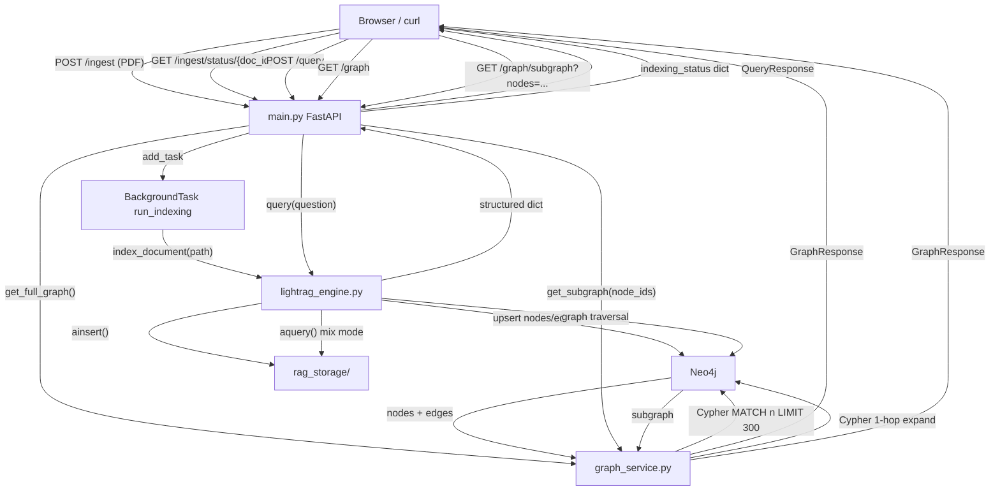

# Phase 2 — FastAPI Backend (5 Endpoints)

## Assumptions

- `GET /graph/subgraph` uses `?nodes=` query param only (no `{query_id}` path segment) per the locked API contract in `CONTEXT.md`. The task description's `{query_id}` is treated as a label, not a path param.
- Uploaded PDFs are saved permanently to `backend/documents/` (consistent with where pre-indexed docs live).
- `doc_id` = the uploaded file's filename (e.g. `truecaller_tos.pdf`). This matches the lock contract `{"doc_id": "<filename>"}`.
- The Neo4j async driver uses a module-level lazy singleton (first call initializes it, reused thereafter). Occam's Razor — no lifespan context manager needed for a single-user demo.
- `doc_filter` wires into `QueryParam(ids=[full_path])`. LightRAG's `ids` field restricts **vector retrieval** to chunks from that file; graph traversal remains keyword-anchored (correct behavior per design decision). The full path is reconstructed inside `lightrag_engine.query()` from the documents directory + the filename sent by the client. Graph nodes from the `/graph/subgraph` response include **all edges** connected to returned nodes regardless of source document — this is intentional for the 2D graph visualization.

## Graph Traversal Design (how multi-document isolation works)

LightRAG `mode="mix"` runs two parallel retrievals:

- **Vector lane**: finds text chunks by semantic similarity. Each chunk is tagged with `file_path` from `ainsert(file_paths=[...])`. When `doc_filter` is set, `QueryParam(ids=[full_path])` restricts this lane to only chunks from that document.
- **Graph lane**: starts from entity nodes matching the query keywords (e.g. "Truecaller", "contacts") and traverses their relationships. This is naturally isolated by the specificity of the keyword anchor — asking about Truecaller starts at the TRUECALLER node. Generic shared nodes (DATA_SHARING, USER_DATA) may appear in both documents' subgraphs, but the LLM has the file-cited text context to stay on topic.
- The `graph_nodes_involved` list returned by the LLM reflects **only the nodes it actually reasoned over**, not all traversed nodes. This is what gets passed to `/graph/subgraph` for frontend highlighting.

---

## Files to Create/Modify

### 1. `backend/main.py` (NEW — explicitly listed in CONTEXT.md folder structure)

**Pydantic models** (define at top of file, strict types):

- `QueryRequest(question: str, doc_filter: str | None = None)`
- `SourceClause(file: str, excerpt: str)`
- `QueryResponse(answer: str, risk_level: str, source_clauses: list[SourceClause], graph_nodes_involved: list[str])` — shape is locked, do not alter
- `IngestResponse(status: str, doc_id: str, message: str)`
- `StatusResponse(doc_id: str, status: str)`
- `GraphNode(id: str, label: str, type: str)`
- `GraphEdge(source: str, target: str, label: str)`
- `GraphStats(node_count: int, edge_count: int)`
- `GraphResponse(nodes: list[GraphNode], edges: list[GraphEdge], stats: GraphStats)`

**App setup:**

- `app = FastAPI(title="PolicySattva API")`
- `CORSMiddleware` with `allow_origins=["http://localhost:5173", "http://localhost:3000"]`, `allow_methods=["*"]`, `allow_headers=["*"]`
- Module-level `indexing_status: dict[str, str] = {}` — the only state

**Endpoint: `POST /ingest`**

- Signature: `async def ingest(file: UploadFile, background_tasks: BackgroundTasks)`
- Validate `file.content_type == "application/pdf"`, raise HTTP 400 if not
- Save file bytes to `backend/documents/{file.filename}` using async write (`await file.read()`, then write to disk)
- `doc_id = file.filename`
- Set `indexing_status[doc_id] = "indexing"`
- `background_tasks.add_task(run_indexing, doc_id, saved_path)` — FastAPI supports async callables in `add_task`
- Return immediately: `IngestResponse(status="indexing", doc_id=doc_id, message="Indexing started")`

`**run_indexing(doc_id, path)` helper (async):**

- Wrap the call to `lightrag_engine.index_document(path)` in try/except
- On success: `indexing_status[doc_id] = "ready"`
- On exception: `indexing_status[doc_id] = "failed"`, log the error

**Endpoint: `GET /ingest/status/{doc_id}`**

- Look up `indexing_status.get(doc_id)`
- If not found, return HTTP 404 with detail `"Unknown doc_id"`
- Return `StatusResponse(doc_id=doc_id, status=status)`

**Endpoint: `POST /query`**

- Signature: `async def query_endpoint(body: QueryRequest)`
- Call `result = await lightrag_engine.query(body.question, doc_filter=body.doc_filter)`
- Cast `result["source_clauses"]` to `list[SourceClause]` — the dicts from `_parse_analysis_block` already have `file` and `excerpt` keys
- Return `QueryResponse(**result)` — the shape is already exactly right from Phase 1

**Endpoint: `GET /graph`**

- Call `await graph_service.get_full_graph()`
- Return the result directly (already shaped as `GraphResponse`)

**Endpoint: `GET /graph/subgraph`**

- Query param: `nodes: str` (comma-separated, e.g. `"data_sharing,third_party"`)
- Parse: `node_ids = [n.strip() for n in nodes.split(",") if n.strip()]`
- Call `await graph_service.get_subgraph(node_ids)`
- Return result as `GraphResponse`

---

### 2. `backend/graph_service.py` (NEW — explicitly listed in CONTEXT.md folder structure)

Use `AsyncGraphDatabase` from the `neo4j` package (already in `requirements.txt`). Import `_candidate_targets` from `neo4j_connection` to reuse the cloud→local fallback logic.

**Driver singleton:**

```python
_async_driver = None

async def _get_driver():
    global _async_driver
    if _async_driver is None:
        for target in _candidate_targets():
            if not target.password:
                continue
            _async_driver = AsyncGraphDatabase.driver(
                target.uri, auth=(target.username, target.password)
            )
            return _async_driver
        raise RuntimeError("No Neo4j target configured")
    return _async_driver
```

`**get_full_graph() -> dict`:**

Run two Cypher queries in a single async session:

1. Nodes query — match all nodes where `entity_id` property exists (LightRAG stores entities this way regardless of workspace label):

```cypher
   MATCH (n) WHERE n.entity_id IS NOT NULL
   RETURN n.entity_id AS id LIMIT 300
   

```

1. Edges query — directed relationships between those nodes:

```cypher
   MATCH (n)-[r]->(m)
   WHERE n.entity_id IS NOT NULL AND m.entity_id IS NOT NULL
   RETURN n.entity_id AS source, m.entity_id AS target, type(r) AS label
   LIMIT 300
   

```

Map each node to `GraphNode(id=record["id"], label=record["id"], type="entity")`.
Map each edge to `GraphEdge(source=..., target=..., label=...)`.
`stats = GraphStats(node_count=len(nodes), edge_count=len(edges))`.

Use `driver.execute_query(cypher, database_=target.database)` for clean async queries.

`**get_subgraph(node_ids: list[str]) -> dict`:**

Single Cypher query to get requested nodes + their 1-hop neighbors:

```cypher
MATCH (n) WHERE n.entity_id IN $node_ids
OPTIONAL MATCH (n)-[r]-(neighbor)
WHERE neighbor.entity_id IS NOT NULL
RETURN n.entity_id AS center,
       neighbor.entity_id AS neighbor_id,
       type(r) AS rel_label,
       startNode(r).entity_id AS src,
       endNode(r).entity_id AS tgt
```

Collect all unique node ids (centers + neighbors), build `GraphNode` list. Collect all relationships into `GraphEdge` list (deduplicate by `(src, tgt, label)` tuple).

---

### 3. `backend/lightrag_engine.py` (EDIT — wire doc_filter)

**Change only `query()`** — do not touch `index_document()` or any other function.

Update the signature to: `async def query(question: str, doc_filter: str | None = None) -> dict[str, object]`

Inside the function, before calling `rag.aquery()`:

- If `doc_filter` is not None, construct the full path: `full_path = str(Path(__file__).resolve().parent / "documents" / doc_filter)`
- Pass `ids=[full_path]` to `QueryParam` alongside the existing parameters
- If `doc_filter` is None, omit `ids` entirely (pass `ids=None` or just don't include it)

`QueryParam.ids` (confirmed present in LightRAG v1.4.10) restricts vector chunk retrieval to the matched file. The graph traversal lane is unaffected — it stays keyword-anchored.

---

### 4. `backend/requirements.txt` (EDIT — add one line)

Add `python-multipart` — required by FastAPI for `UploadFile` / `multipart/form-data` parsing. Without it, FastAPI raises a 422 on any file upload endpoint.

---

### 5. `README.md` (EDIT — add Phase 2 section)

Add a Phase 2 section with:

- Install deps: `uv pip install -r backend/requirements.txt`
- Start server: `cd backend && uvicorn main:app --reload --port 8000`
- Sample curl commands for each endpoint

---

## Data Flow




---

## Test Commands (provide these after implementation)

```bash
# Start server
cd backend && uvicorn main:app --reload --port 8000

# Ingest
curl -X POST http://localhost:8000/ingest \
  -F "file=@documents/truecaller_tos.pdf"

# Poll status
curl http://localhost:8000/ingest/status/truecaller_tos.pdf

# Query
curl -X POST http://localhost:8000/query \
  -H "Content-Type: application/json" \
  -d '{"question": "Does Truecaller share my contacts?", "doc_filter": null}'

# Full graph
curl http://localhost:8000/graph

# Subgraph
curl "http://localhost:8000/graph/subgraph?nodes=data_sharing,third_party,contacts"
```

